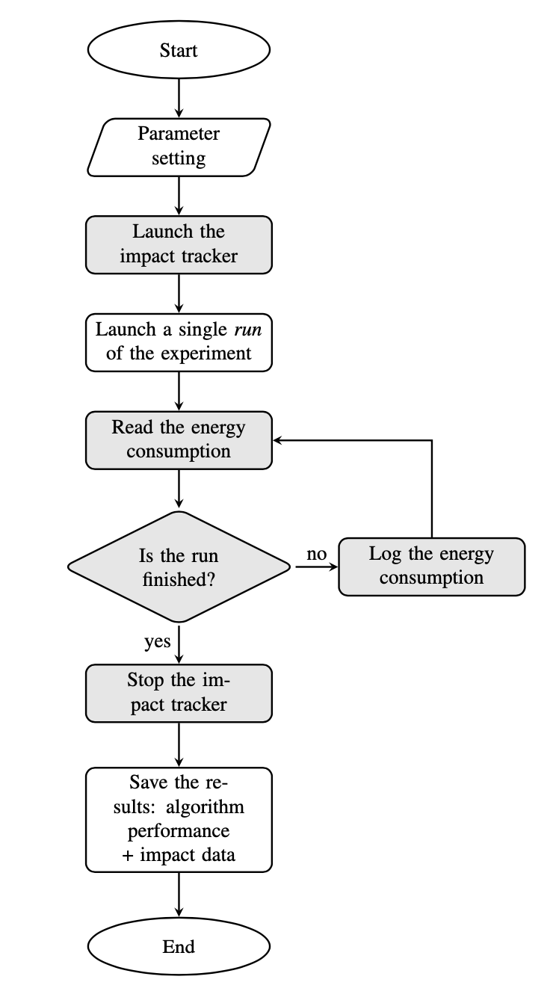
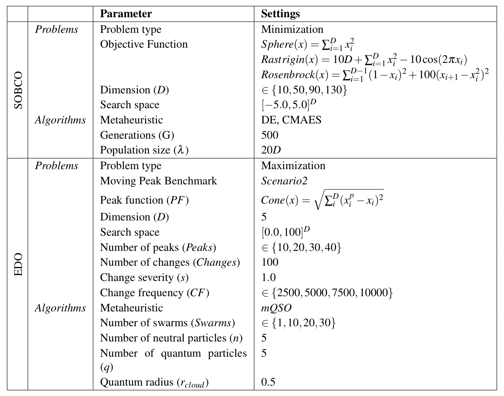
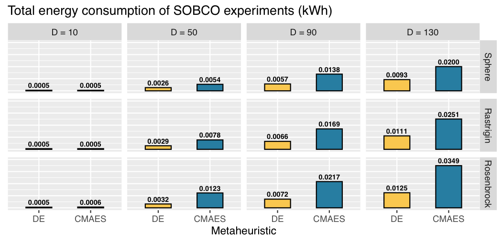
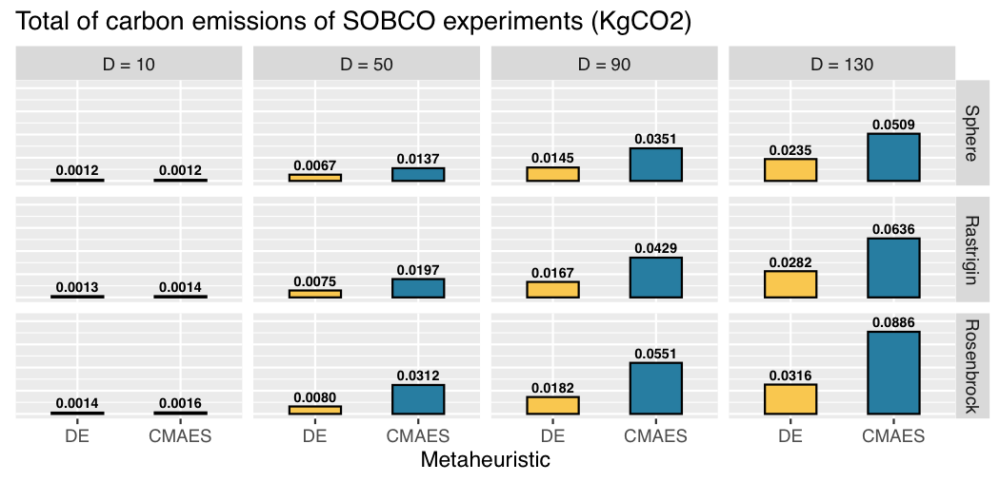
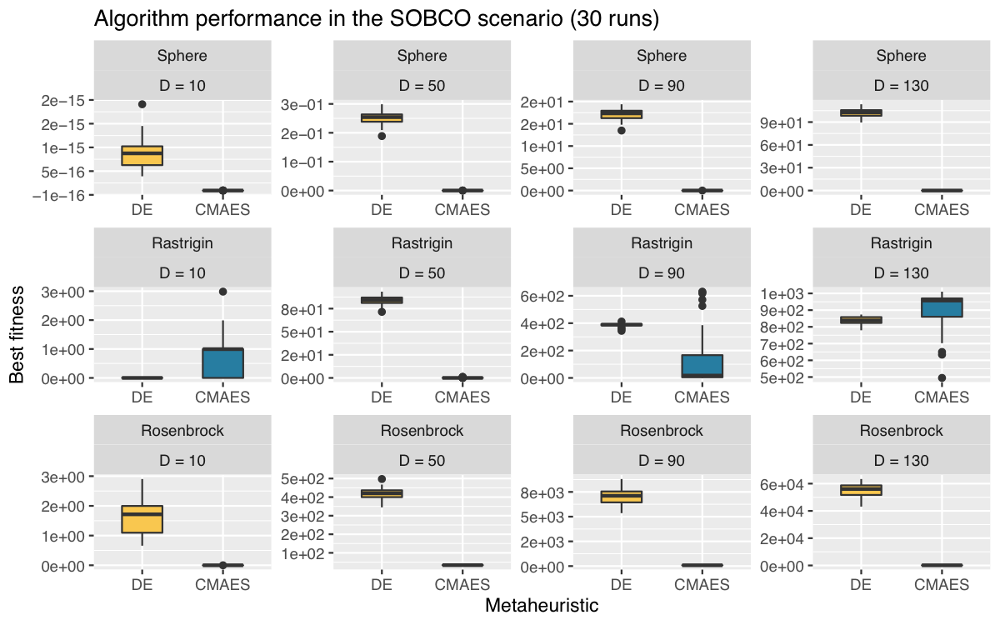
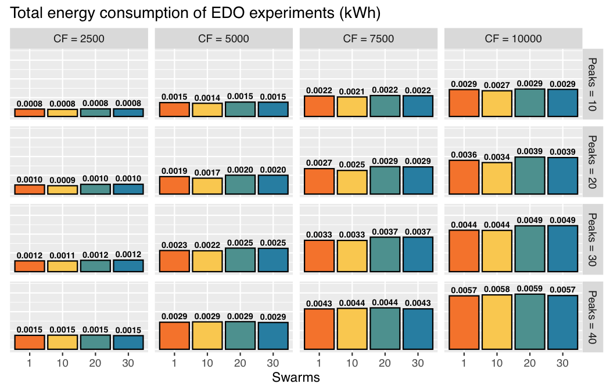
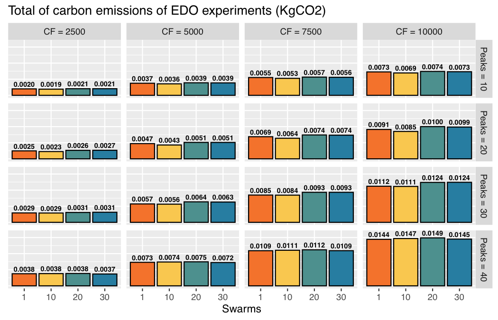
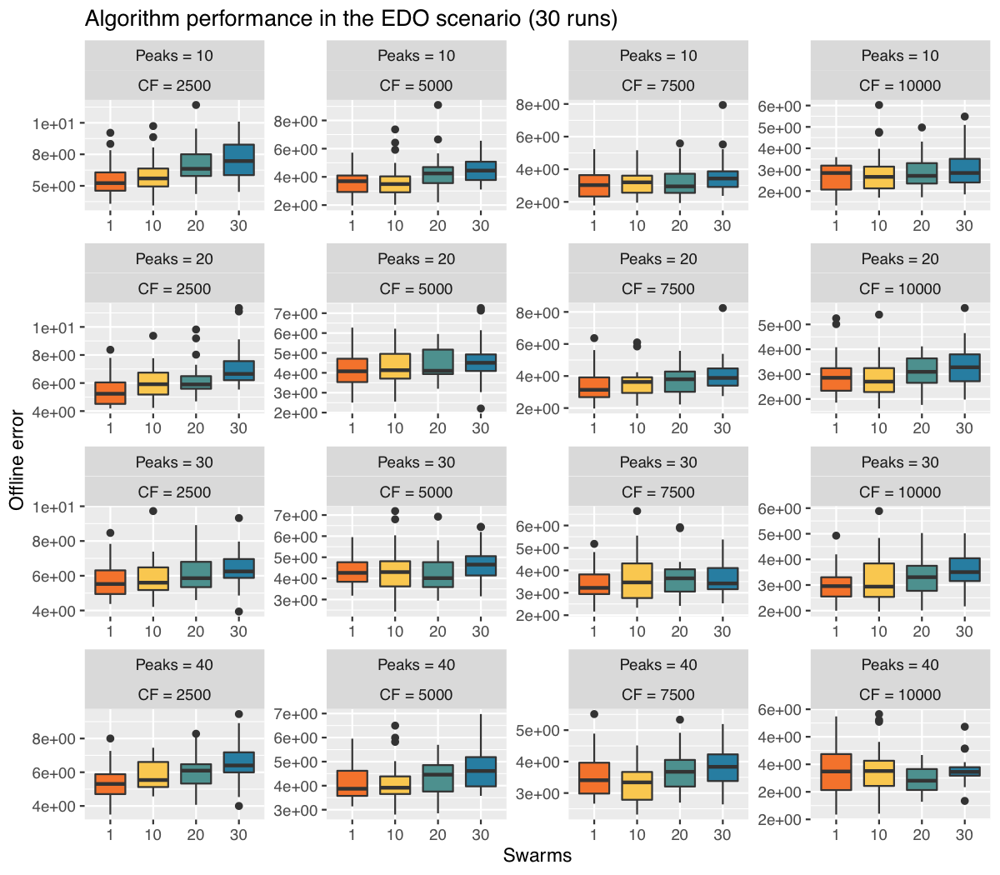

# Measuring the environmental cost of metaheuristics

This project aims at measuring the environmental cost of experimenting with metaheuristics in two typical scenarios: 1) single objective bound constrained optimization (SOBCO) and 2) evolutionary dynamic optimization (EDO). To this end we employed the framework **experiment-impact-tracker** proposed in https://github.com/Breakend/experiment-impact-tracker as follows (gray boxes):

To implement the algorithms and problems, we relied on the DEAP framework [1].

## SOBCO and EDO parameter settings

The experiments in SOBCO and EDO relied in the following parameter settings:

As for the execution environment we used the following settings for both set of experiments:

| **Parameter**               | **Settings**                                                             |
|-----------------------------|--------------------------------------------------------------------------|
| Runs                        | 30                                                                       |
| Random seed                 | {1,2,...,30}                                                 |
| Performance measure SOBCO   | Best fitness                                                             |
| Performance measure EDO     | Offline error                                                            |
| Computer                    | iMac (Retina 5K, 27-inch, 2019)                                          |
| Operating System            | macOS Big Sur 11.1                                                       |
| CPU                         | Intel(R) Core(TM) i5-8500 CPU @ 3.00GHz                                  |
| RAM                         | 40 GB 2667 MHz DDR4                                                      |

## Results

### SOBCO

### EDO

## Social cost by country

## References

[1] F.-A. Fortin, F.-M. D. Rainville, M.-A. Gardner,M. Parizeau, C. Gagné, Deap: Evolutionary algorithms made easy, Journal of Machine LearningResearch 13 (70) (2012) 2171–2175
