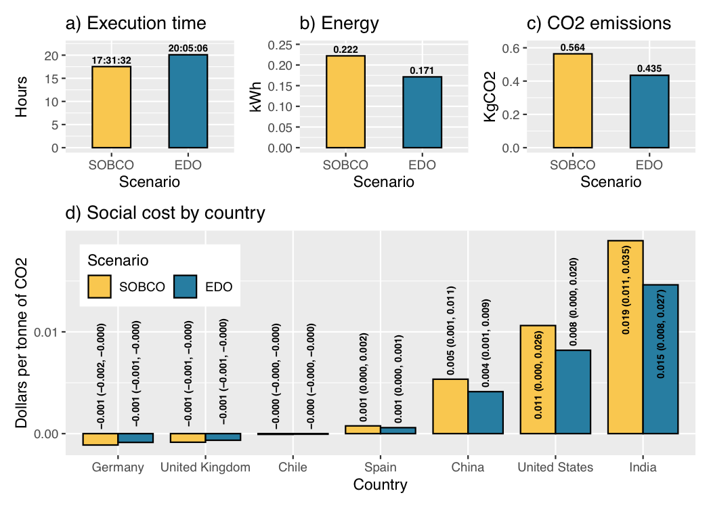

This project aims at measuring the environmental cost of experimenting with metaheuristics in two typical scenarios: 1) single objective bound constrained optimization (SOBCO) and 2) evolutionary dynamic optimization (EDO). To this end we employed the framework **experiment-impact-tracker** proposed in https://github.com/Breakend/experiment-impact-tracker as follows (gray boxes):

To implement the algorithms and problems, we relied on the DEAP framework [1].

## SOBCO parameter settings

The experiments in SOBCO relied in the following parameter settings:

|             | **Parameter**               | **Settings**                                                             |
|-------------|-----------------------------|--------------------------------------------------------------------------|
|*Problems*   | Problem type                | Minimization                                                             |
|             | Dimension (D)             |                                                 |
|             | Objective Function          | |
|             |                             |             |
|             |                             |  |
|             | Search space                |                                                           |
|*Algorithms* | Metaheuristic               | DE, CMAES                                                                |
|             | Generations (G)             | 500                                                                    |
|             | Population size             | 20D                                                                    |

## EDO parameter settings

|                 | **Parameter**                     | **Settings**                                  |
|-----------------|-----------------------------------|-----------------------------------------------|
| *Problems*      | Problem type                      | Maximization                                  |
|                 | Moving Peak Benchmark             | *Scenario2*                            |
|                 | Dimension (D)                   | 5                                           |
|                 | Peak function (PF)              |  |
|                 | Search space                      |                                 |
|                 | Number of peaks (Peaks)         |                       |
|                 | Number of changes (Changes)     | 100                                         |
|                 | Change severity (s)             | 1.0                                         |
|                 | Change frequency (CF)           |              |
|*Algorithms*     | Metaheuristic                     | mQSO                                        |
|                 | Number of swarms ($Swarms$)       |                        |
|                 | Number of neutral particles (n) | 5                                           |
|                 | Number of quantum particles (q) | 5                                           |
|                 | Quantum radius                  | 0.5                                           |

As for the execution environment we used the following settings for both set of experiments:

| **Parameter**               | **Settings**                                                             |
|-----------------------------|--------------------------------------------------------------------------|
| Runs                        | 30                                                                       |
| Random seed                 |                                                  |
| Performance measure SOBCO   | Best fitness                                                             |
| Performance measure EDO     | Offline error                                                            |
| Computer                    | iMac (Retina 5K, 27-inch, 2019)                                          |
| Operating System            | macOS Big Sur 11.1                                                       |
| CPU                         | Intel(R) Core(TM) i5-8500 CPU @ 3.00GHz                                  |
| RAM                         | 40 GB 2667 MHz DDR4                                                      |

# Results

## SOBCO

## EDO

# Social cost by country

# References

[1] F.-A. Fortin, F.-M. D. Rainville, M.-A. Gardner,M. Parizeau, C. Gagné, Deap: Evolutionary algorithms made easy, Journal of Machine LearningResearch 13 (70) (2012) 2171–2175
